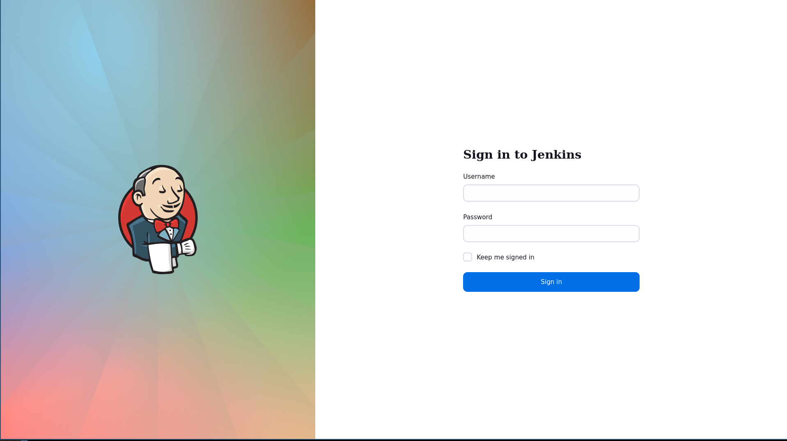
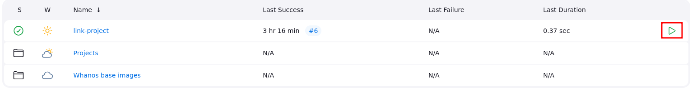

# Develop and Deploy a Whanos project

## Prerequisites

The project must be a supported language:

- C
- Java
- JavaScript
- Python
- Befunge

**Your project must be in a accessible git repository**. It can be Github, Gitlab or a private git server. Whanos can access it via access tokens, credentials or a SSH key.

## Criterias for Supported Languages

### C

- Default compiler: GNU Compiler Collection 13.2.
- Criteria of detection: Has a Makefile file at the root of the repository.
- Dependency system: None.
- Compilation: Using “make”.
- Execution: With the resulting compiled binary.
- Base image name: whanos-c.

### Java

- Default version: Java SE 21.
- Criteria of detection: Has a pom.xml file in the app repository.
- Dependency system: Maven.
- Compilation: Using “mvn package”.
- Execution: Using “java -jar app.jar”.
- Base image name: whanos-java.

### Javascript

- Default version: Node.js 20.9.
- Criteria of detection: Has a package.json file at the root of the repository.
- Dependency system: npm.
- Compilation: Not applicable.
- Execution: Using “node .”.
- Base image name: whanos-javascript.

### Python

- Default version: 3.12.
- Criteria of detection: Has a requirements.txt file at the root of the repository.
- Dependency system: pip.
- Compilation: Not applicable.
- Execution: Using “python -m app”.
- Base image name: whanos-python.

### Befunge

- Default version: Befunge-93.
- Criteria of detection: Has a single main.bf file in the app directory.
- Dependency system: Not applicable.
- Compilation: Free choice.
- Execution: Free choice, from the root of the repository.
- Base image name: whanos-befunge.

## Custom Image

For each language, there is a default Docker image, but you can define a `Dockerfile` **at the repo of your repository** which might contian modifications.
It must import the **base image of the language** however.

Example of a typescript application from the javascript base Whanos image:

```dockerfile
FROM whanos-javascript

RUN npm install -g typescript@4.4.3

COPY tsconfig.json /app/tsconfig.json

RUN tsc

RUN find . -name "*.ts" -type f -not -path "./node_modules/*" -delete

CMD ["node", "app.js"]
```

## Deployment Script

If the project must be published to the whole world, you need to setup a `whanos.yml` **at the repo of your resporitory**.

Here's what the content of the file must have:

- **replicas** -> number of replicas to have (default: 1; 2 replicas means that 2 instances of the resulting
pod must be running at the same time in the cluster);
- **resources** -> resource needs, corresponding to Kubernetes’ own resource specifications (default:
no specifications; the syntax expected here is the same as the given link);
- **ports** -> an integer list of ports needed by the container to be forwarded to it (default: no ports
forwarded)

## Linking to Whanos

With the head server IP (external IP from the IaC output),
connect via a web browser to the url (with user modification):

**Replace `{head_server_ip}` with the saved head external IP without the brackets.**
```
http://{head_server_ip}:8080/
```

You should see a login screen:



Once logged in, click on the green arrow framed in red:



From this, go to the documentation of [Linking a Project](./Link_a_Project.md).
