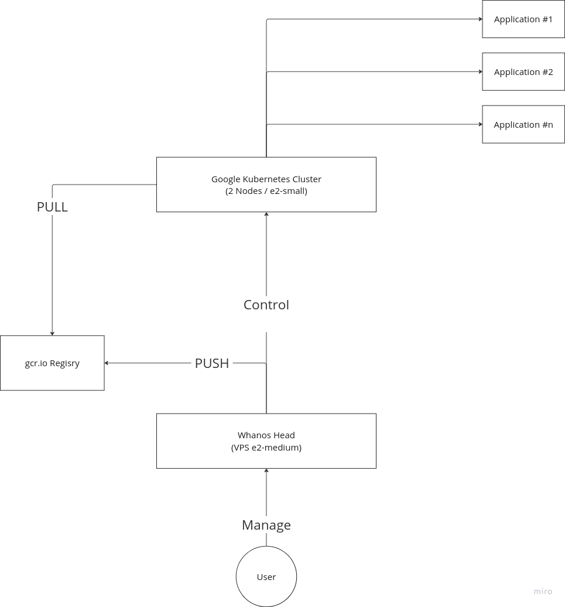
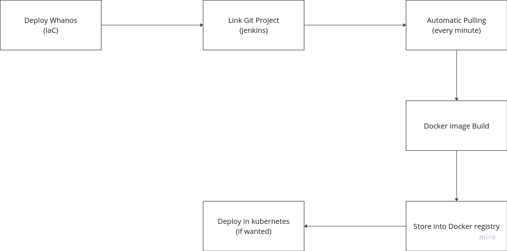

# Whanos Project

The project aims to save and deploy automatically your projects in the cloud via Google.

## How it works

Here's the schema of the project at the end.

The user is the adminitrator, linking and monitoring the applications.

Here's a detailed look of the workflow, of how Whanos is processing the application deployment from the absolute start:

## Installations

Here is the table of the tutorial of successfully initialize the whanos project.

| Link           | Description          |
|----------------|---------------------------------------------------------------|
| [Creating Google Project](./Creating_Google_Account.md) | Creating the google project, service account necessary for Whanos infrastructure. |
| [Install Google Cloud Infrastructure](./Install_Google_Cloud_Infrastructure.md) | Initialize the necessary cloud ressources for whanos (VPS, Kubernetes Cluster) |
| [Install Whanos Software](./Install_Whanos_Softwares.md) | Install the necessary softwares and permissions for Whanos to function |
| [How to Install an Application](./How_To_Develop_Project.md) | Once the installation is done, deploy an application ! |

## Developers

If you're aspiring to be a Whanos developer, check the documentation here: [Developer Introduction](./Developper_Introduction.md).
