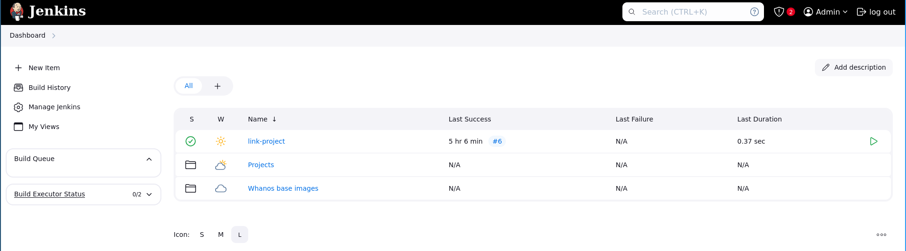
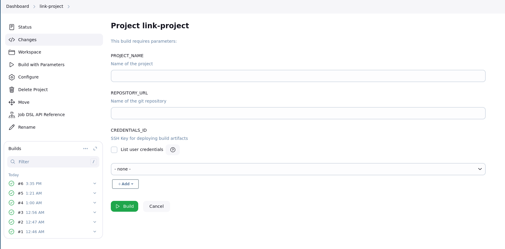

# Link a Project

Connect to jenkins with the user `admin` and the password you defined earlier in `JENKINS_USER_PASSWORD` variable in the `.env` file.

You should see this dashboard once logged in:

**From the dashboard, click the green arrow logo on the right of the workflow** `link-project`.

## Build Parameters

Here what the page looks like:

Here are the necessary descriptions:

- Project_name
  - Project name that will be the workflow name created, as well as the pod name if the project should be deployed.

- Repository URL
  - Git url to clone from

- Credentials_ID
  - If the git project is private, the jenkins must login. It can be with:
    - Username and Password
    - Auth token
    - Certificate

What you need to set for the creditions is told via Jenkins.

Once everything is setup, you can return to the dashboard and go to: `Projects/<project_name>`.

## Build Manually the Project

### Build

Once you're in the workflow from `Projects/<project_name>`. Click on `Build Now` if you wish to build immediately. The workflow would have done it itself 1 minute after the project linking (due to automatic pulling).

This should trigger the worflows to build the docker image and potentially deploy in the cluster.

If you wish to know more about the success of the workflow (instead of the status logo on the left). You can go to the `Console Output` menu.
From this you can gather these types of log:

- Git pulling
- Docker build
- Docker push to repository
- Kubectl applying the Deployment and Service file for the application
- Awaiting the application external IP adddress

### Monitor Workflow

The workflow outputs numerous informations useful to debug the program's building process. Plus it shows the deployment logs and outputing the **external ip of the program**.
